# Project 6 — Containerized Microservices on Amazon ECS Fargate

**AWS Solutions Architect – Associate | AWS Project**
**Author:** BENZIDANE Taha · benzidaneyoucef40@gmail.com

> Migrating a monolithic Node.js application into three independently deployable microservices — **Auth**, **Orders**, and **Notifications** — running serverlessly on **Amazon ECS Fargate**, discoverable via **AWS Cloud Map**, load-balanced by an **Application Load Balancer**, backed by **ElastiCache (Valkey/Redis)** for shared session state, secured with **AWS Secrets Manager**, and deployed automatically through a **CodePipeline + CodeBuild** CI/CD pipeline.

---

## 🧭 My Approach: Build in Phases, Prove It, Then Build the Next Layer

Before touching the AWS console, I broke this project into **six sequential phases**, treating each one like a small deployment increment rather than trying to design the entire stack up front. The rule I held myself to was simple:

> **Don't move to the next phase until the current one is verified working, end to end.**

This is basically DevOps discipline applied to a solo learning project — small, testable increments instead of one giant "big bang" deployment. Practically, that meant:

1. **Build the smallest working unit first** (three plain Express services, running locally).
2. **Containerize and validate locally** before anything touched AWS — if it didn't run correctly in Docker on my machine, it had no business going into ECS.
3. **Deploy one layer of infrastructure at a time** (registry → compute → networking/discovery → configuration → automation), verifying health checks and logs after *each* layer before adding the next.
4. **Treat failures as design signals, not blockers** — for example, discovering the Blue/Green CodeDeploy pattern wasn't viable on the account tier I was using wasn't a dead end, it was a trade-off decision to document (more on that below).

The result is an architecture that was never "deployed and hoped for the best" — every phase has a corresponding health check, log inspection, or browser test that proved it before I moved on.

---

## 🏗️ Architecture Diagram

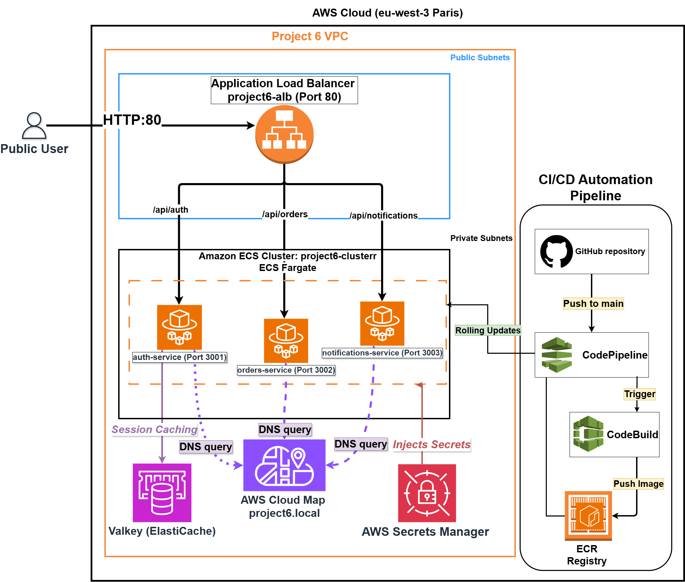

**Request flow:** a public user hits the ALB on port 80 → path-based routing (`/api/auth`, `/api/orders`, `/api/notifications`) sends traffic to the matching ECS Fargate service in the private subnets. Each service resolves the others through **AWS Cloud Map** (`project6.local`), reads/writes sessions in **Valkey (ElastiCache)**, and pulls `JWT_SECRET` from **AWS Secrets Manager** at startup.

**Deployment flow (right side):** a push to `main` on GitHub triggers **CodePipeline**, which runs **CodeBuild** to build and push a new image to **ECR**, then rolls it onto the ECS service — no manual console steps.

---

## 🧰 Tech Stack & AWS Services

| Layer | Service | Purpose |
|---|---|---|
| Compute | **Amazon ECS on Fargate** | Serverless container hosting — no EC2 patching or provisioning |
| Registry | **Amazon ECR** | Private image storage with vulnerability scan-on-push |
| Networking | **Application Load Balancer** | Single public entry point with path-based routing to 3 services |
| Service Discovery | **AWS Cloud Map + ECS Service Connect** | Private DNS namespace (`project6.local`) so containers resolve each other by name, not IP |
| State | **Amazon ElastiCache (Valkey, Redis-compatible)** | Centralized session store shared across stateless containers |
| Security | **AWS Secrets Manager** | Runtime injection of `JWT_SECRET` — never hardcoded, never in plaintext env vars |
| CI/CD | **AWS CodePipeline + CodeBuild** | Automated build → push → deploy on every `git push` |
| IAM | **Task Execution Role / Task Role** | Least-privilege access to ECR, Secrets Manager, and CloudWatch |
| Observability | **Amazon CloudWatch Logs** | Centralized container logs for startup and runtime verification |

> **Not yet implemented:** AWS X-Ray distributed tracing and a full Blue/Green (CodeDeploy) rollout — see [Design Decisions](#-key-design-decisions--trade-offs) and [What's Next](#-whats-next--future-improvements) below for why, and what I'd add for a v2.

---

## 📦 Repository Structure

```
project6-microservices/
├── README.md
├── docs/
│   └── architecture-diagram.png
├── screenshots/
│   ├── phase1-auth-health-local.png
│   ├── phase1-orders-local.png
│   ├── phase1-notifications-local.png
│   ├── phase1-auth-login-postman.png
│   ├── phase2-ecr-repositories.png
│   ├── phase3-ecs-cluster-created.png
│   ├── phase3-task-definition-auth.png
│   ├── phase3-alb-details.png
│   ├── phase4-elasticache-valkey.png
│   ├── phase4-cloudmap-namespace.png
│   ├── phase5-env-variables.png
│   ├── phase5-secrets-manager-secret.png
│   ├── phase6-target-group-healthy-auth.png
│   ├── phase6-target-group-healthy-orders.png
│   ├── phase6-target-group-healthy-notifications.png
│   ├── phase6-alb-auth-health.png
│   ├── phase6-alb-orders-health.png
│   ├── phase6-alb-notifications-health.png
│   ├── phase6-logs-auth-service.png
│   ├── phase6-logs-orders-service.png
│   ├── phase6-logs-notifications-service.png
│   └── phase6-codepipeline-success.png
├── auth-service/
│   ├── src/
│   │   └── server.js
│   ├── package.json
│   ├── Dockerfile
│   └── buildspec.yml
├── orders-service/
│   ├── src/
│   │   └── server.js
│   ├── package.json
│   └── Dockerfile
└── notifications-service/
    ├── src/
    │   └── server.js
    ├── package.json
    └── Dockerfile
```

> Each service folder is self-contained: its own `package.json`, `Dockerfile`, and (for `auth-service`, the one wired to CI/CD) its own `buildspec.yml`.

---

## 🚀 Phase-by-Phase Breakdown

### Phase 1 — Foundation: Three Microservices, Containerized & Locally Validated

**Objective:** Stand up three independent, lightweight Node.js (Express) services and prove each one runs correctly in Docker *before* any AWS resource is created.

**What I built:**
- `auth-service` (port 3001) — mock login endpoint, issues a mock JWT
- `orders-service` (port 3002) — returns a mock order list
- `notifications-service` (port 3003) — returns mock alert data
- Each service has a dedicated `/health` route (e.g. `/api/auth/health`) — this matters later, since ECS and the ALB both depend on health check endpoints to know a container is alive
- A `Dockerfile` per service (Node 18 Alpine base, install deps, expose the service port, run `node src/server.js`)

**How I verified it:**
```bash
docker build -t auth-service:v1 .
docker run -p 3001:3001 auth-service:v1
curl http://localhost:3001/api/auth/health
```
Repeated for all three services, confirming each returned a `200 OK` with the expected JSON body before moving forward. I also exercised the Auth service's `POST /api/auth/login` route directly (via Postman) to confirm the mock authentication logic — not just the health check — worked before containerizing.

| Auth health check | Orders mock data | Notifications mock data |
|---|---|---|
| 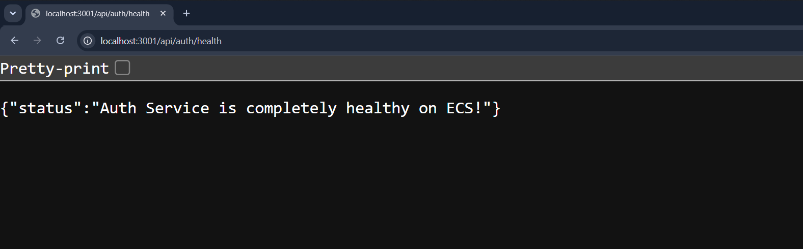 | 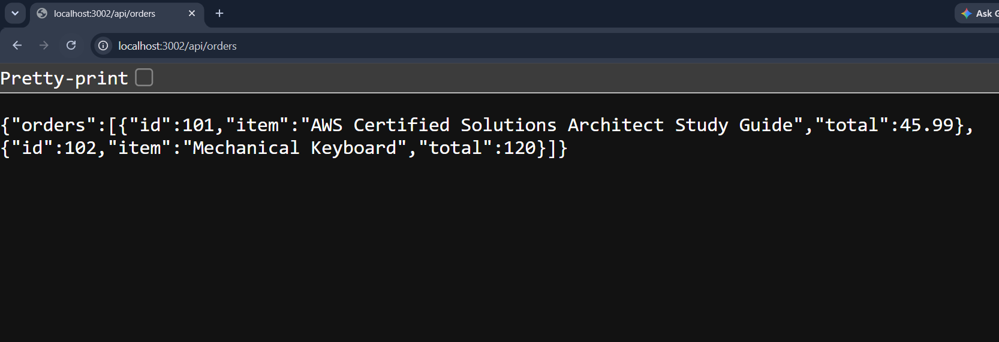 | 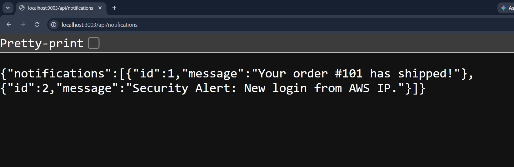 |

**Login endpoint test (Postman):**

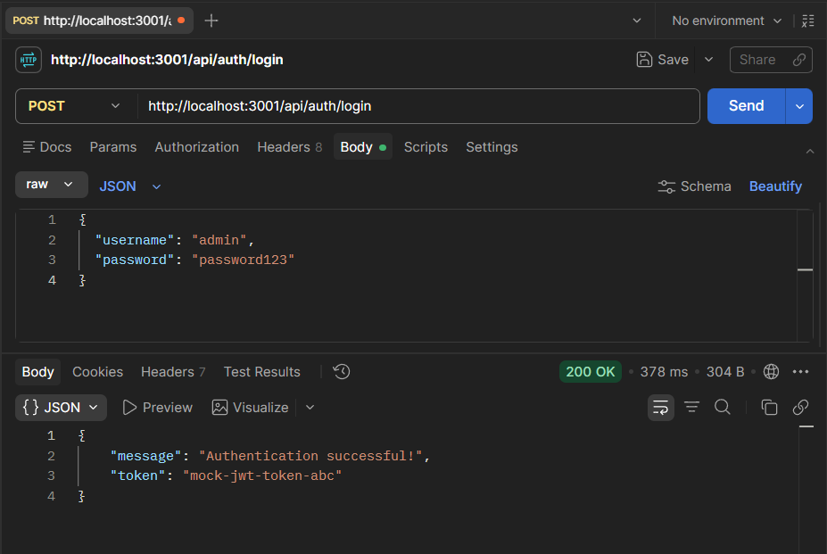

---

### Phase 2 — Image Registry: Pushing to Amazon ECR

**Objective:** Get the three validated local images into a private, versioned registry AWS can pull from.

**What I built:**
- Three private **Amazon ECR** repositories, one per microservice
- Authenticated the local Docker daemon against ECR via the AWS CLI
- Tagged and pushed each image

**Why ECR and not Docker Hub:** keeping images private and inside the AWS network avoids public exposure, integrates directly with ECS task definitions via ARN, and — importantly — supports **scan-on-push**, so every image gets a vulnerability scan the moment it lands in the registry.

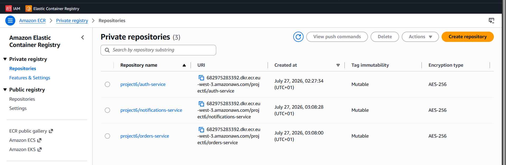

*Three private repositories — `project6/auth-service`, `project6/orders-service`, `project6/notifications-service` — each AES-256 encrypted.*

---

### Phase 3 — Deployment & Traffic Routing: ECS Fargate + ALB

**Objective:** Run the containers serverlessly and give the outside world a single URL that intelligently routes to the correct service.

**What I built:**
- **ECS Task Definitions** for each service, specifying image URI, vCPU/memory, and container port
- A dedicated security group (`project6-microservices-sg`) allowing inbound traffic only on the three service ports, scoped to the load balancer
- Three **Target Groups** (`auth-tg`, `orders-tg`, `notifications-tg`) with custom health check paths (e.g. `/api/auth/health`) — critical, because without a correct health check path the ALB will mark a perfectly healthy container as failing and cycle it endlessly (Exit Code 137)
- A public **Application Load Balancer** on port 80 with **path-based listener rules** routing `/api/auth*`, `/api/orders*`, `/api/notifications*` to their respective target groups
- An **ECS Cluster** (`project6-cluster`) running all three Fargate services

**How I verified it:** Confirmed the cluster and task definition were created successfully, then confirmed the ALB was active with a valid DNS name. (Full target-group health and live traffic verification happens in Phase 6, once every layer is wired up.)

| ECS cluster created | Task definition (Fargate) | ALB active + DNS name |
|---|---|---|
| 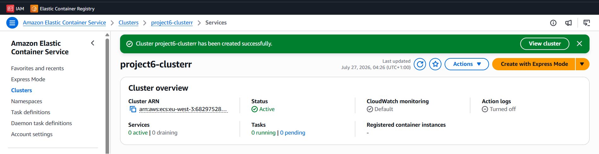 | 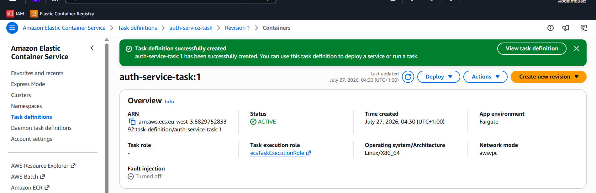 | 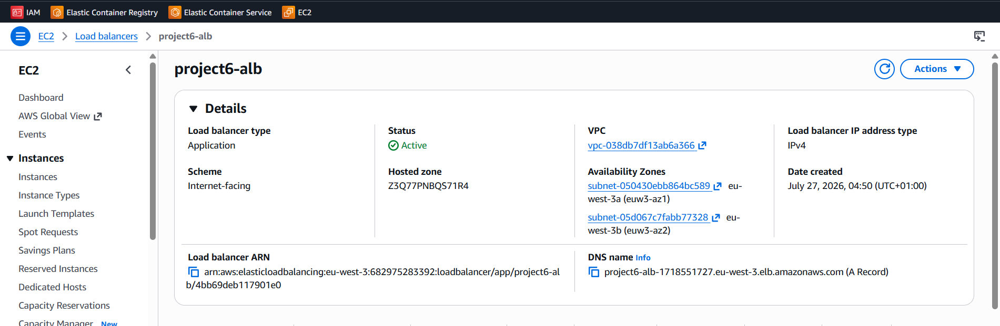 |

---

### Phase 4 — Statefulness & Service Discovery

**Objective:** Solve two problems that only show up once you have *multiple* stateless, ephemeral containers: (1) containers forget everything on restart, and (2) containers can't reliably find each other by IP.

**What I built:**
- **Amazon ElastiCache for Valkey** (Redis-compatible), single-node `cache.t4g.micro`, as a centralized session store so a container restart doesn't wipe a logged-in user's session
- A locked-down security group (`project6-redis-sg`) allowing inbound port 6379 **only** from the microservices security group — no direct internet access to the cache, ever
- An **AWS Cloud Map** private DNS namespace (`project6.local`)
- **ECS Service Connect** enabled on all three services (Client and Server mode), registering each container into the namespace automatically on deploy

**Why this matters:** once Service Connect was on, `orders-service` could call `auth-service.project6.local:3001` directly — no hardcoded IPs, no manual DNS management, and it survives every container restart.

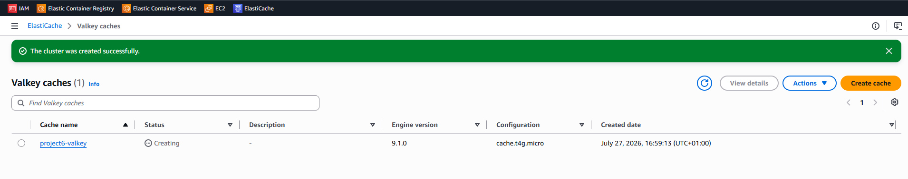

*`project6-valkey`, single-node `cache.t4g.micro`, Valkey engine 9.1.0 — provisioning after security group and subnet group were locked down.*

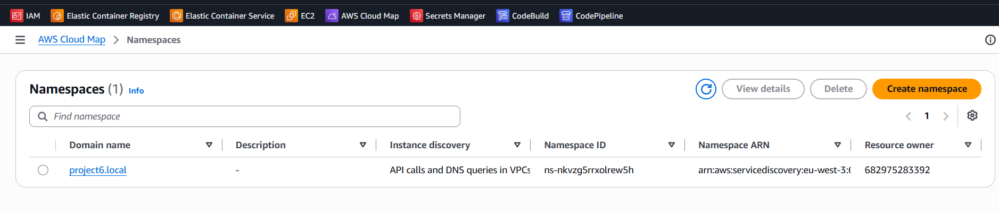

*`project6.local` namespace, instance discovery set to **API calls and DNS queries in VPCs** — private and unreachable from outside the VPC.*

---

### Phase 5 — Configuration & Secrets Management

**Objective:** Wire the infrastructure built in Phase 4 into the actual application code, and eliminate plaintext secrets from the equation entirely.

**What I built:**
- **Environment variables** injected into each Task Definition revision (`VALKEY_HOST`, `AUTH_SERVICE_URL`, `ORDERS_SERVICE_URL`, `NOTIFICATIONS_SERVICE_URL`) so each service knows how to reach its dependencies without hardcoding
- A secret in **AWS Secrets Manager** (`project6/auth-secrets`) holding `JWT_SECRET`
- IAM permissions on the ECS Task Execution Role scoped to `secretsmanager:GetSecretValue` for that specific secret ARN — least privilege, not a blanket policy
- Task Definition updated to use `valueFrom` (pointing at the secret ARN) instead of a plaintext environment variable, so the secret is fetched securely at container startup and injected directly into memory (`process.env.JWT_SECRET`) — never written to disk, logs, or source control

**Why this matters (and why it's worth calling out for the Security domain of the exam):** plaintext environment variables in a Task Definition are visible to anyone with IAM read access to the ECS console, can't be rotated without redeploying, and risk leaking into version control if a task definition is ever exported. Routing through Secrets Manager closes all three gaps.

**Task Definition — environment variables + secret injection:**

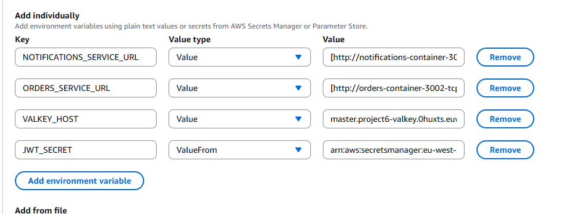

*Notice `JWT_SECRET` uses **ValueFrom** (pointing at the Secrets Manager ARN) while the service-discovery URLs and `VALKEY_HOST` are plain values — only the actual secret is routed through Secrets Manager.*

**Secrets Manager:**

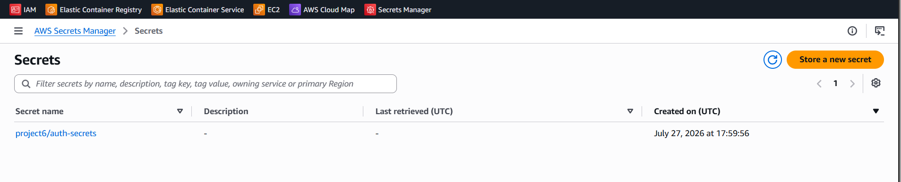

---

### Phase 6 — Validation & CI/CD Automation

**Objective:** Prove the whole stack works from the outside exactly as a real user would experience it, then remove the human from the deployment loop entirely.

**Step 1 — Target group health.** Before trusting the public URL, I confirmed the ALB considered every container healthy:

| Auth (`auth-tg`) | Orders (`orders-tg`) | Notifications (`notifications-tg`) |
|---|---|---|
| 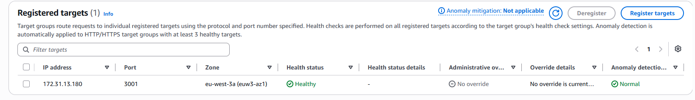 | 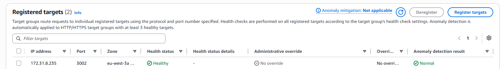 | 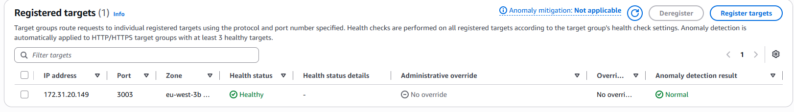 |

**Step 2 — Live traffic through the public ALB.** Hit all three health endpoints through `project6-alb-1718551727.eu-west-3.elb.amazonaws.com` and got live JSON straight from the Fargate containers — proving the path-based routing rules built in Phase 3 actually work end to end:

| `/api/auth/health` | `/api/orders/health` | `/api/notifications/health` |
|---|---|---|
| 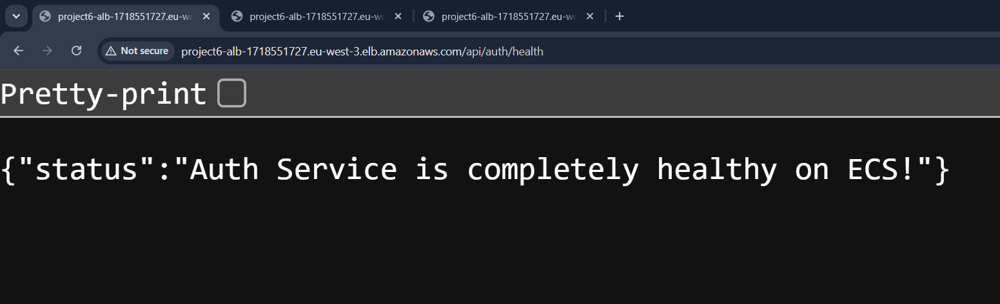 | 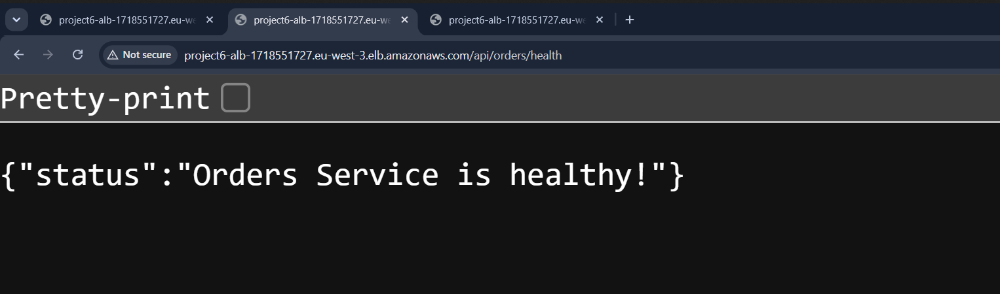 | 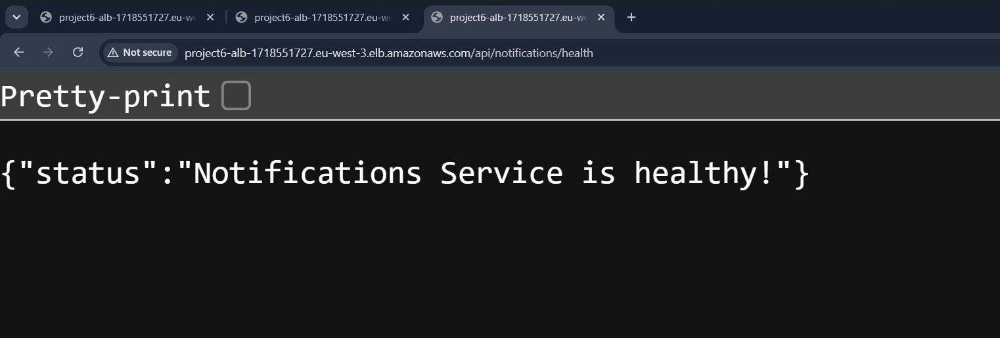 |

**Step 3 — CloudWatch logs & service status.** Confirmed every ECS service was `Active`, running its desired task count, with a `Success` deployment status and clean startup logs:

| auth-service | orders-service | notifications-service |
|---|---|---|
| 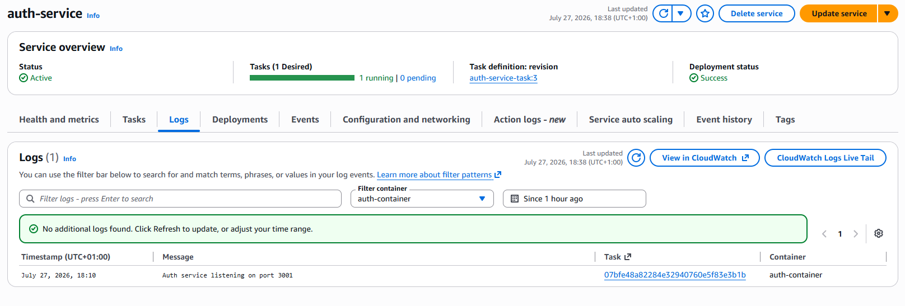 | 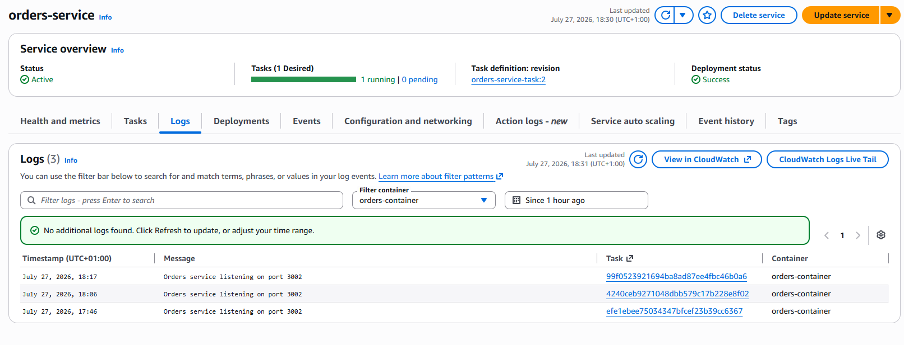 | 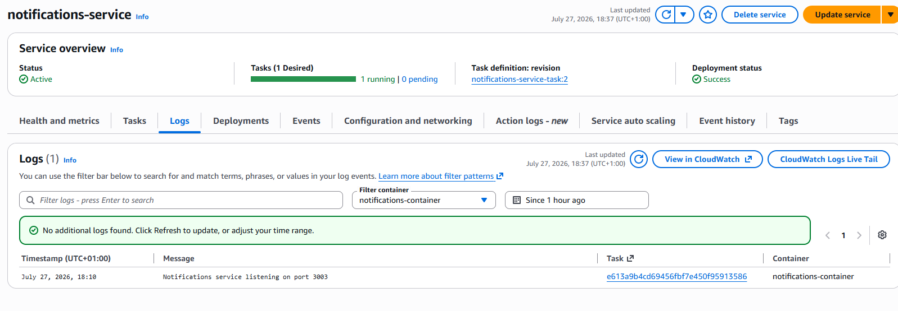 |

**CI/CD pipeline:**
- Wrote a `buildspec.yml` telling **CodeBuild** how to log into ECR, build the Docker image, tag it with the Git commit hash, push both `:latest` and the commit-tagged version, and emit an `imagedefinitions.json` artifact
- Built a **CodePipeline** (`project6-auth-pipeline`) with three stages:
  1. **Source** — GitHub (Version 2 connection), triggers on push to `main`
  2. **Build** — CodeBuild (Ubuntu standard image, privileged mode enabled for Docker-in-Docker)
  3. **Deploy** — Amazon ECS action, pointed at `project6-cluster` / `auth-service`, consuming `imagedefinitions.json`
- Attached `AmazonEC2ContainerRegistryPowerUser` to the CodeBuild service role so it could push to ECR
- **Proved it live:** changed a response string in `auth-service`, pushed to `main`, and watched CodePipeline automatically build, push, and roll the change onto Fargate with zero manual console steps

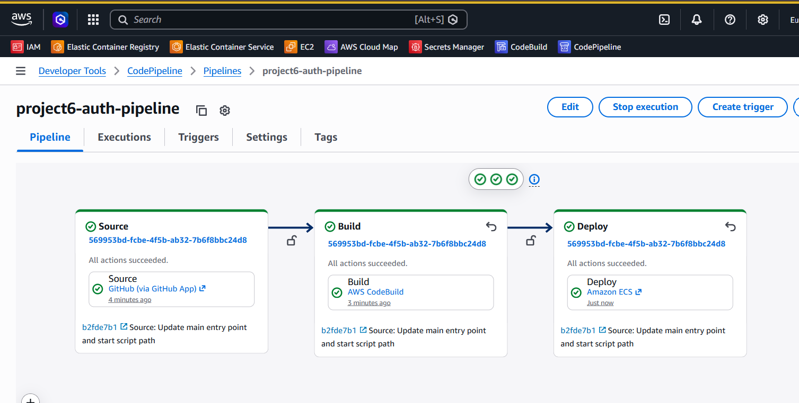

*`project6-auth-pipeline` — Source (GitHub App) → Build (CodeBuild) → Deploy (Amazon ECS), all three stages succeeded automatically from a single `git push`.*

---

## 🎯 Key Design Decisions & Trade-offs

### Why Rolling Updates instead of Blue/Green (CodeDeploy)

The original plan for this project called for **CodeDeploy Blue/Green deployments** — spinning up a fully separate "green" environment, testing it on a secondary listener port, then flipping the ALB over once healthy. I built the groundwork for this (a second target group, a test listener on port 8080), then hit a real-world constraint: **CodeDeploy's Blue/Green ECS integration wasn't available on the account tier I was working with.**

Rather than block the whole project on that, I made a deliberate trade-off:

| | Blue/Green (CodeDeploy) | Rolling Update (native ECS) |
|---|---|---|
| Downtime risk | Near-zero, instant rollback | Brief, gradual replacement |
| Infra overhead | Extra target group + test listener | None — just the existing service |
| Complexity | Higher | Lower |
| Cost | Higher (duplicate capacity during shift) | Lower |
| Available on my account tier | ❌ | ✅ |

I removed the unused green target group and test listener (leaving no dangling, unbilled resources), and let **CodePipeline talk directly to the ECS service**, which performs a standard rolling deployment natively — no CodeDeploy required. For a solo-service graduation project this is a completely reasonable trade-off; in production, with three services and stricter uptime SLAs, I'd revisit Blue/Green (see below).

### Why session state lives in Valkey/Redis, not the container

Fargate containers are stateless by design — AWS can restart one at any time. Anything a user expects to persist across requests (like "am I logged in") has to live outside the container. ElastiCache gives every container instance a shared, fast, centralized place to read and write that state.

### Why Cloud Map over hardcoded IPs or a static config file

Fargate doesn't guarantee a stable IP across restarts. Cloud Map + Service Connect means services address each other by a permanent DNS name (`auth-service.project6.local`) and AWS handles the IP resolution underneath — no redeploying every service just because one IP changed.

---

## 🧪 How to Run Locally

```bash
# From any service folder, e.g. auth-service/
npm install
npm start
# Auth:          http://localhost:3001/api/auth/health
# Orders:        http://localhost:3002/api/orders
# Notifications: http://localhost:3003/api/notifications
```

Or via Docker:
```bash
docker build -t auth-service:v1 .
docker run -p 3001:3001 auth-service:v1
```

---

## ✅ What This Project Demonstrates (Manara Learning Outcomes)

- Building and pushing Docker images to ECR, and configuring ECS Task Definitions correctly
- Designing ECS Fargate services with appropriately scoped IAM task and execution roles
- Implementing service-to-service communication via Cloud Map DNS-based discovery
- Configuring ALB path-based routing to front multiple independent microservices
- Managing secrets securely with Secrets Manager instead of hardcoded/plaintext credentials
- Evaluating deployment strategies (Blue/Green vs. Rolling) against real cost and account constraints — and documenting *why*, not just *what*
- Automating the full build-push-deploy loop with CodePipeline + CodeBuild, with zero manual deployment steps after a `git push`

---

## 🔭 What's Next / Future Improvements

- **AWS X-Ray** — add distributed tracing across the three services for a full request-level service map
- **Blue/Green via CodeDeploy** — revisit on a production-tier account for true zero-downtime, instant-rollback deployments
- **Per-service pipelines** — currently one CodePipeline covers `auth-service`; replicating it for `orders-service` and `notifications-service` would let each deploy independently
- **RDS or DynamoDB integration** — currently all data is mocked in-memory; swapping in a real datastore would complete the picture

---

*© 2026 BENZIDANE Taha — benzidaneyoucef40@gmail.com*
